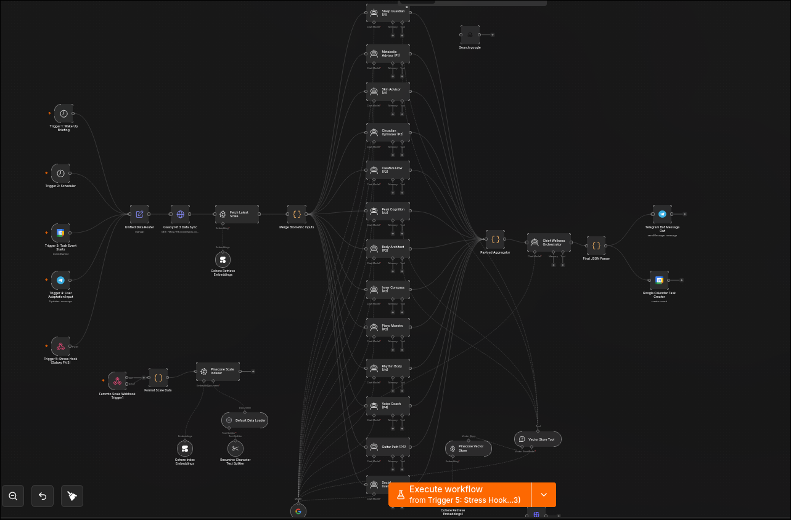

# Context-Aware Multi-Agent Resource Allocation Framework

This repository contains a modular, template-based blueprint for a context-aware, multi-agent scheduling and decision engine. The framework ingests multi-source data streams (telemetry, user messaging, and calendar signals), processes them through parallelized specialist agents with distinct operational parameters, evaluates the output via a dynamic mathematical priority algorithm, and dispatches unified scheduling decisions to external applications.

---

## 1. System Architecture

The workflow executes a non-blocking parallel routing design structured across five ingress triggers:

```
                  ┌────────────────────────────────────────┐
                  │          5 Ingress Triggers            │
                  │  (Cron / Webhook / Event / Messaging)  │
                  └───────────────────┬────────────────────┘
                                      │
                                      ▼
                        ┌───────────────────────────┐
                        │   Global Signal Router    │
                        └─────────────┬─────────────┘
                                      │
                                      ▼
                        ┌───────────────────────────┐
                        │ Data Ingress Normalizer   │
                        └─────────────┬─────────────┘
                                      │
         ┌────────────────────────────┼────────────────────────────┐
         ▼                            ▼                            ▼
┌─────────────────┐          ┌─────────────────┐          ┌─────────────────┐
│ Agent_Recovery  │          │ Agent_Timeline  │          │  Agent_Social   │
│  (Strict-0.1)   │          │ (Balanced-0.5)  │          │ (Creative-0.85) │
└────────┬────────┘          └────────┬────────┘          └────────┬────────┘
         │                            │                            │
         └────────────────────────────┼────────────────────────────┘
                                      │
                                      ▼
                        ┌───────────────────────────┐
                        │ Dynamic Priority Scoring  │
                        └─────────────┬─────────────┘
                                      │
                                      ▼
                        ┌───────────────────────────┐
                        │Unified SystemOrchestrator │
                        └─────────────┬─────────────┘
                                      │
                      ┌───────────────┴───────────────┐
                      ▼                               ▼
          ┌───────────────────────┐       ┌───────────────────────┐
          │  Calendar Scheduler   │       │  UI Msg Dispatcher    │
          └───────────────────────┘       └───────────────────────┘
```

---

## 2. Dynamic Prioritization Mechanics

Rather than relying on static prioritizations, the decision engine computes an execution index for every proposed action using a dynamic score formula:

$$\text{Final Score} = (6 - \text{Default Priority Weight}) \times \text{Urgency Metric} \times \text{Temporal Multiplier}$$

### Override Behavior (Anomaly Signal)
When **Trigger 5 (System Anomaly Signal)** registers a threshold exception, the scoring engine dynamically alters runtime priority variables:
*   Critical containment and regulation agents (e.g., `Agent_Social`, `Agent_Regulation`) have their default priority weights elevated to `1`.
*   High-demand physical or cognitive action items (e.g., `Agent_Structural`, `Agent_Cognition`) have their urgency multipliers suppressed to `0`.
*   This alters the scheduled output to focus entirely on system safety and containment protocols.

---

## 3. Telemetry Schema Reference

### Expected Ingress JSON Structure
Data entering the `Data Ingress Normalizer` must match the following schema:

```json
{
  "timestamp": "2026-06-04T10:32:00Z",
  "triggerSource": "ingress_sensor",
  "signal_alpha": 64.2,
  "signal_beta": 12.5,
  "signal_gamma": 30.1,
  "metric_weight": 78.4,
  "metric_hydration": 61.2
}
```

### Agent Output JSON Schema
To remain compatible with the centralized aggregation node, every custom specialist agent must return its recommendations formatted exactly as follows:

```json
{
  "agent_id": "agent_identifier_string",
  "default_weight": 3,
  "urgency": 4,
  "action_item": "Specific protocol or action directive to execute",
  "reasoning": "Data-backed logical proof supporting this execution index",
  "timing_window": "immediate", 
  "duration_minutes": 45
}
```
*Valid `timing_window` values:* `immediate` (Multiplier: 2.0), `optimal` (Multiplier: 1.5), or `standard` (Multiplier: 1.0).

---

## 4. Local Deployment & Networking Guide

When hosting this multi-agent framework locally (such as on Fedora/Linux) and interfacing with mobile telemetry clients, certain default firewall and communication policies must be addressed.

### A. Android Cleartext Security Policies
By default, mobile operating systems prevent non-browser applications from transmitting unencrypted data (`http://`) to local network IP addresses. 
*   **The Problem:** Direct local POST requests to `http://192.168.1.X:5678` fail due to OS-level security constraints.
*   **The Fix:** Establish a secure HTTPS tunnel on the host machine to route payload requests safely.

#### Running cloudflared on Fedora:
1. Install the official Cloudflare package:
   ```bash
   sudo dnf install cloudflared -y
   ```
2. Launch a temporary public tunnel pointed directly to your n8n runtime port:
   ```bash
   cloudflared tunnel --url http://localhost:5678
   ```
3. Copy the secure **`https://your-unique-subdomain.trycloudflare.com`** URL generated in the terminal output and use it as your application's destination host.

### B. HTTP Method Alignment
To prevent `404 Not Found` routing failures:
*   Ensure the Webhook Trigger node inside n8n is configured with the **HTTP Method** parameter set to **`POST`**.
*   Standard browser visits generate `GET` requests; mobile background sync engines utilize `POST` requests to transmit database payloads. A method mismatch will result in routing rejections.

